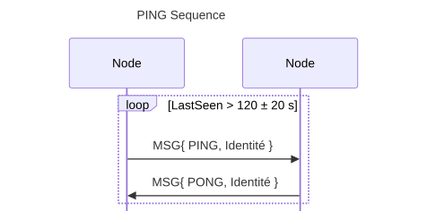

## Structure de données

### Peer

| Champs   | Type       | Description                         |
| ---------| -----------| ------------------------------------|
| IP       | netip.Addr | Adresse IP du noeud                 |
| Port     | uint16     | Port exposé par le noeud            |
| Name     | Text       | Nom du noeud                        |
| State    | PeerState  | Les informations de l'état du Peer  |

### PeerState

| Champs    | Type       | Description                                                  |
| ----------| -----------| -------------------------------------------------------------|
| Age       | time.Time  | Date de démarrage du noeud  (format RFC3339 (UTC))           |
| Nodes     | int        | Nombre de noeuds connu par ce peer                           |
| PeerCount | time.Time  | Dernière fois que le noeud à été vu  (format RFC3339 (UTC))  |
| LastSeen  | time.Time  | Dernière fois que le noeud à été vu  (format RFC3339 (UTC))  |
| LastPing  | time.Time  | Dernière fois qu'un PING à été envoyé (format RFC3339 (UTC)) |
| Absent    | uint8      | compteur de non réponse                                      |

## Les différents messages

### PING

Test si un noeud est en ligne, envoi également son identité pour permettre
au noeud destinataire d'identifier l'émetteur (paramètre --name, ou POST sur
/api/v1/name).

Attend une réponse de type PONG de la part du noeud destinataire pour
savoir si celui-ci est toujours actif. Récupère également à son tour
L'identité du noeud destinataire.

Lorsqu'un noeud reçoit une trame valide provenant d'un pair (PING, PONG ou
tout autre message), il met à jour LastSeen avec l'heure courante et
réinitialise Absent à 0.

Lorsqu'un PING est reçu, le destinataire répond par un PONG. La réception de
ces deux messages met donc à jour l'état des deux noeuds sans nécessiter de
traitement supplémentaire.

Si aucun message valide n'a été reçu depuis 120 ± 20 s et qu'aucun PING n'a
été envoyé depuis 120 ± 20 s, un nouveau PING est envoyé.

Si aucun PONG n'est reçu avant l'envoi du prochain PING, Absent est incrémenté
de 1.

Toute réception ultérieure d'un message valide remet immédiatement Absent
à 0.

Après trois échecs consécutifs, le pair est retiré de la liste des pairs.

### PEER

Fourni sa liste de noeud à un autre noeud.

### MSG

Envoi un message à un noeud.

